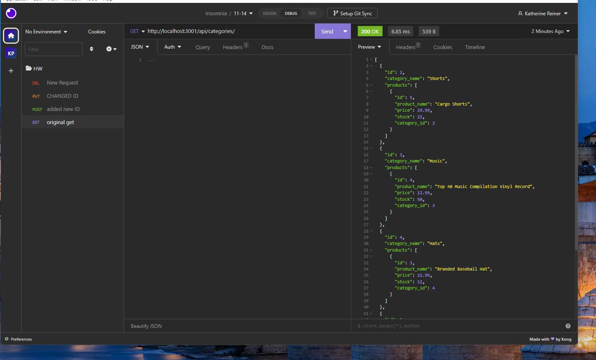

# E-commerce Back End Starter Code# E-CommerceBackEnd

## Name
E-Commerce Back End

## Description
Using this backend code you can view, update, and delete items within the e-commerce database. This application uses the get, put, pull, and delete routes.

## Visuals
Here is a picture of the insomnia! 

## Installation
Within your terminal make sure to run an NPM I to make sure that all applications are properly installed
## Usage
Use examples liberally, and show the expected output if you can. It's helpful to have inline the smallest example of usage that you can demonstrate, while providing links to more sophisticated examples if they are too long to reasonably include in the README.

## Contributing
Collaborated with Johnny McGown

